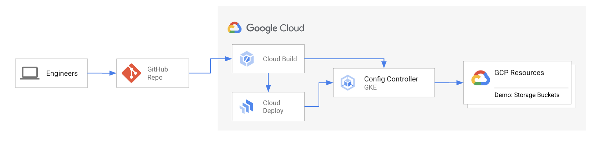

# Automate the creation of GCP Resources
## By Using Config Controller, Cloud Build and Cloud Deploy
### Architecture

#### Read More:
- [Config Controller](https://cloud.google.com/anthos-config-management/docs/concepts/config-controller-overview)
- [Cloud Build](https://cloud.google.com/build/docs/overview)
- [Cloud Deploy](https://cloud.google.com/deploy/docs/overview)

### Breakdown:
- Each "team" has their own folder
- Resources folder defines the environment (Development, Staging and Production) 

